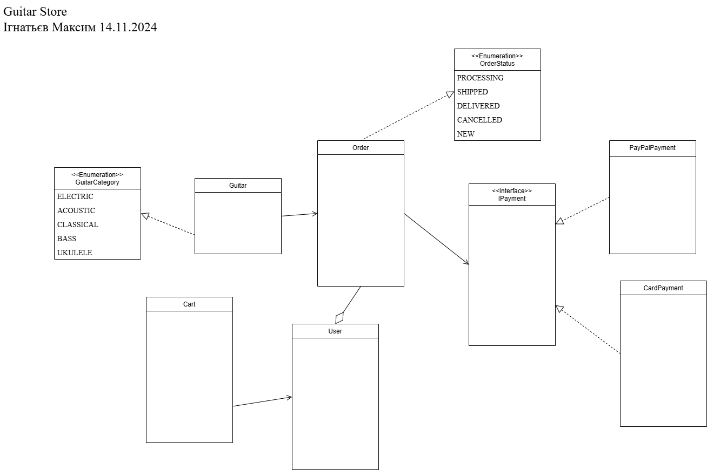
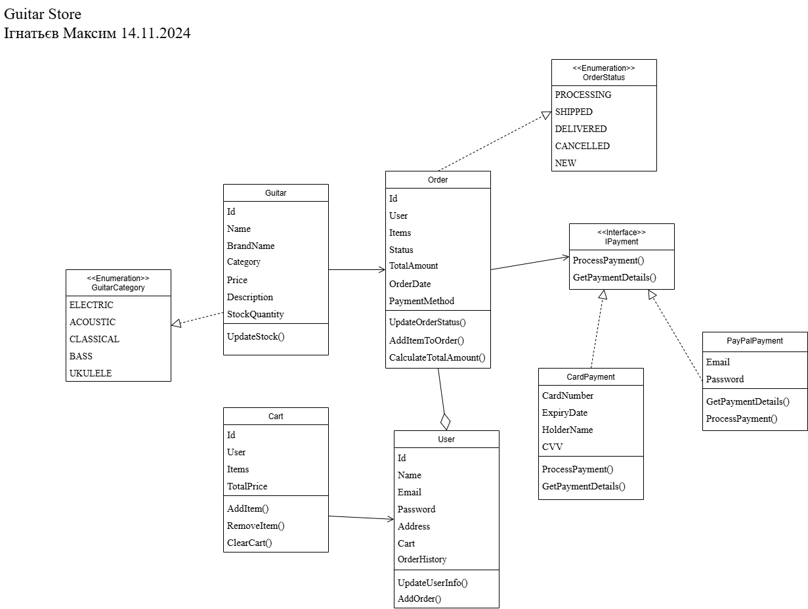

# Магазин продажу гітар

Магазин гітар – це спеціалізований бізнес, який пропонує широкий вибір гітар. Основною метою такого магазину є надання клієнтам можливості придбати інструмент, який відповідає їхнім потребам, уподобанням та фінансовим можливостям.

## Основні аспекти предметної області

### 1. Категорії товарів
Магазин продає різні типи гітар, які класифікуються за категоріями:
- **Електрогітари** – сучасні інструменти для гри в рок, метал чи поп-жанрах.
- **Акустичні гітари** – класичні моделі для живого виконання та акомпанементу.
- **Класичні гітари** – підходять для класичної музики та навчання.
- **Бас-гітари** – для створення ритм-секції в ансамблях.
- **Укулеле** – невеликі гітари, які використовуються для легких мелодій.

### 2. Товари
Кожен інструмент у магазині має такі властивості:
- Унікальний ідентифікатор.
- **Назва** (наприклад, "Fender Stratocaster").
- **Бренд** (наприклад, Gibson, Yamaha, Ibanez).
- **Опис** – характеристика моделі та її особливостей.
- **Ціна** – вартість товару в магазині.
- **Кількість на складі** – для управління запасами.

### 3. Користувачі
Магазин обслуговує клієнтів, які поділяються на:
- **Зареєстрованих користувачів** – мають акаунт, де зберігається історія замовлень та персональна інформація (ім'я, email, адреса).

### 4. Покупки
Покупки здійснюються через:
- **Кошик** – клієнт додає до кошика товари, які він планує придбати. Після цього підраховується загальна сума замовлення.
- **Замовлення** – завершений процес покупки, який зберігає деталі товарів, загальну суму, дату оформлення, статус та спосіб оплати.

### 5. Оплата
Для оплати передбачено кілька способів:
- **Банківські картки** – клієнт вводить дані картки (номер, термін дії, CVV).
- **PayPal** – електронна оплата через популярний сервіс.
  
### 6. Статуси замовлень
Замовлення може мати кілька статусів:
- **Нове** – щойно оформлене.
- **У процесі обробки** – менеджери підтверджують і готують до відправки.
- **Відправлено** – замовлення передано службі доставки.
- **Доставлено** – товар отримано клієнтом.
- **Скасовано** – замовлення скасовано клієнтом або магазином.

### 7. Додаткові функції
- **Управління запасами** – кожен інструмент має кількість на складі, яка оновлюється після продажу.
- **Історія покупок** – зберігає дані про всі попередні замовлення клієнта.
- **Оновлення інформації** – клієнт може змінювати свої дані, такі як адреса або email.

## Базові процеси

### 1. Додавання товару до кошика
Користувач обирає гітару, додає її до кошика. Система автоматично підраховує загальну суму.

### 2. Оформлення замовлення
Коли клієнт готовий до покупки, він вибирає спосіб оплати та підтверджує замовлення. 

### 3. Оплата
Система перевіряє платіжну інформацію. У разі успішної транзакції замовлення стає активним.

### 4. Обробка замовлення
Адміністратор змінює статус замовлення, поки воно не буде доставлено клієнту.

### 5. Оновлення залишків
Після кожного продажу кількість товару на складі зменшується.

---

    
    
Рис. 1. Виявлення та визначення елементів предметної області та зв’язки між ними

    
    
Рис.2. Детальне проєктування елементів моделі предметної області

---
